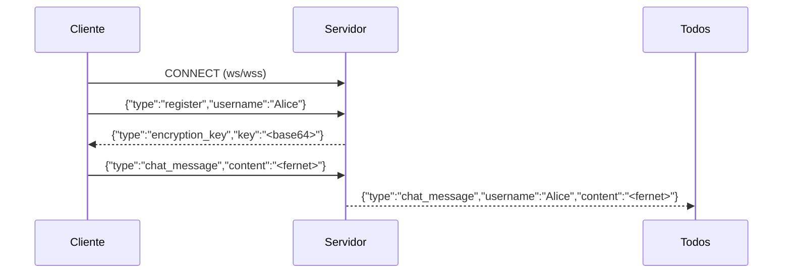

# 🔐 Secure Chat (Python, WebSockets, Fernet, ngrok)

Chat seguro multi-cliente implementado en **Python** usando **WebSockets** y cifrado **Fernet**.  
El servidor genera una clave simétrica y la comparte con los clientes al registrarse.  
Todos los mensajes se transmiten cifrados, y se puede exponer con **ngrok** usando **WSS (TLS)**.

---

## 🧠 Teoría

### WebSockets
- Protocolo full-duplex sobre TCP.
- Ideal para chat en tiempo real.
- Mantiene la conexión abierta (sin múltiples requests HTTP).

### Fernet (cryptography)
- Cifrado simétrico (AES-128/CBC + HMAC-SHA256).
- Garantiza **confidencialidad e integridad**.
- Los mensajes viajan como tokens base64 fáciles de transportar.

### Ngrok
- Genera una URL pública para tu servidor local.
- Convierte conexiones locales en `https://` → `wss://` con **TLS** habilitado.

---

## ⚙️ Flujo del sistema

▶️ Ejemplo (local)

python3 server.py

python3 client.py
¿Usar ngrok? (y/n): n
Host: localhost
Puerto: 8765
Usuario: Alice

python3 client.py
¿Usar ngrok? (y/n): n
Host: localhost
Puerto: 8765
Usuario: Bob

🔐 ¿Por qué es seguro?

Confidencialidad en tránsito: con wss:// los mensajes viajan bajo TLS.
Cifrado en aplicación: Fernet protege contenido (AES + HMAC).
Integridad: HMAC-SHA256 garantiza que nadie alteró el mensaje.
Defensas adicionales: validación de tamaños, rate limiting y sanitización.
